# Architecture Diagrams (Mermaid)

## Diagram Legend
- 1-1xxx: Cash and cash equivalents
- 1-2xxx: Loans and receivables
- 2-1xxx: Member deposits and liabilities
- 2-13xx to 2-14xx: Cash short/over and clearing accounts
- 3-2xxx: Share capital accounts
- 4-4xxx: Income accounts (interest, penalties, fees, recoveries)
- 5-5xxx: Expense accounts (interest expense, loan loss, adjustments)

## Context and Layering
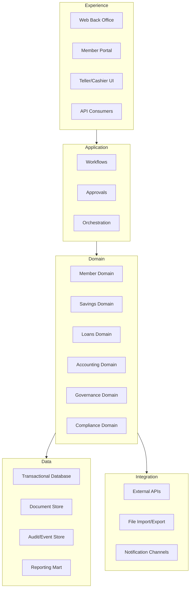

## Core Module Map
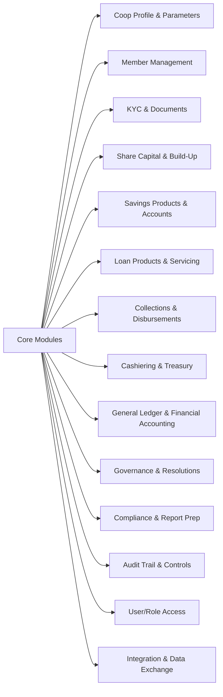

## Loan Origination Workflow
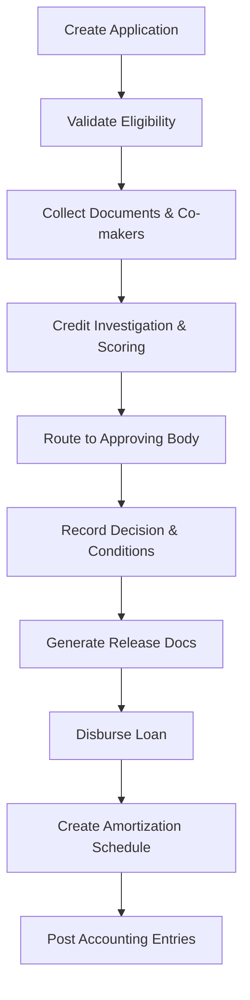

## Cash Session Workflow
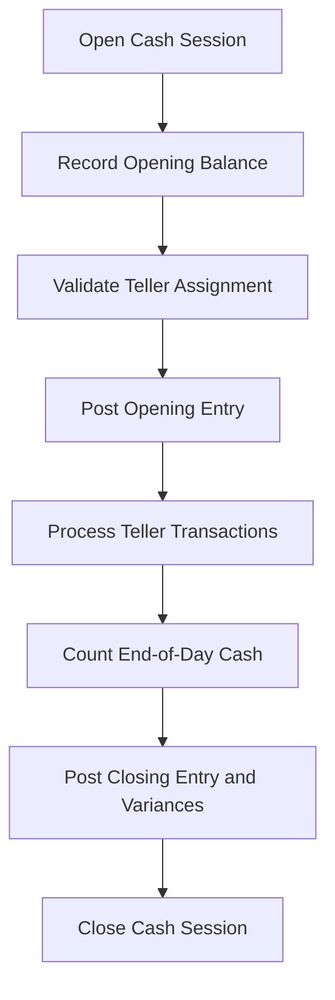

## Teller Transaction Workflow
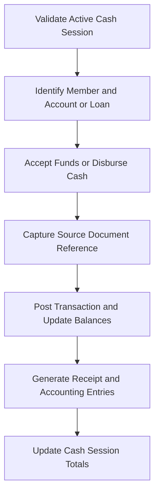

## Swimlane: Member Onboarding
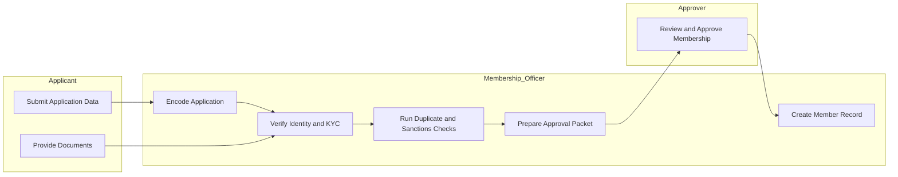

## Swimlane: Savings Deposit or Withdrawal
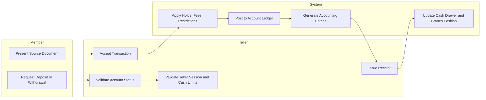

## Swimlane: Loan Origination
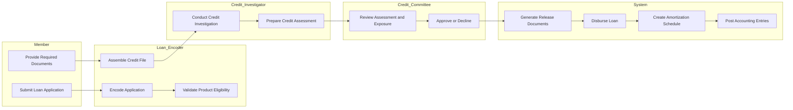

## Swimlane: Cashiering
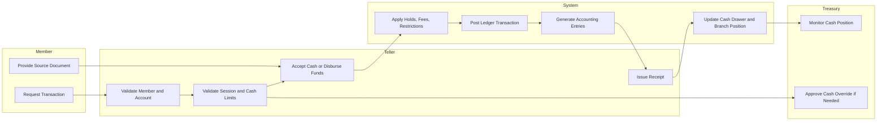

## Swimlane: Period Close
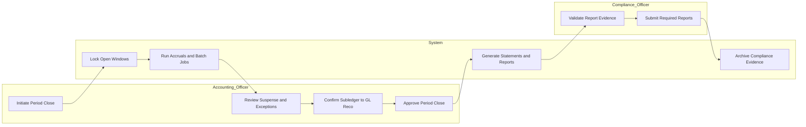

## Accounting Posting Pattern
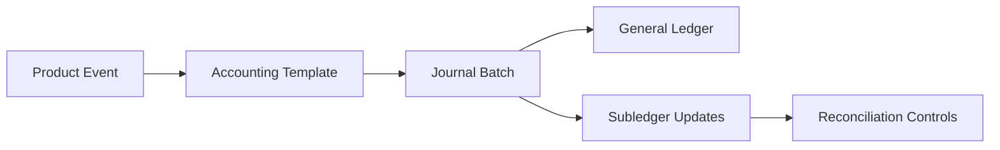

## Account Mapping Workflow
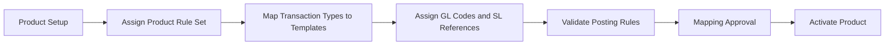

## Product Activation Readiness Checklist
- Product parameters configured and saved.
- Rule set assigned and validated against eligibility constraints.
- All transaction types mapped to accounting templates.
- GL codes and SL references mapped for each template.
- Posting rules validated with a sample transaction.
- Mapping approval evidence captured (approver, timestamp, rationale, version).
- Required documents and approval matrices assigned.
