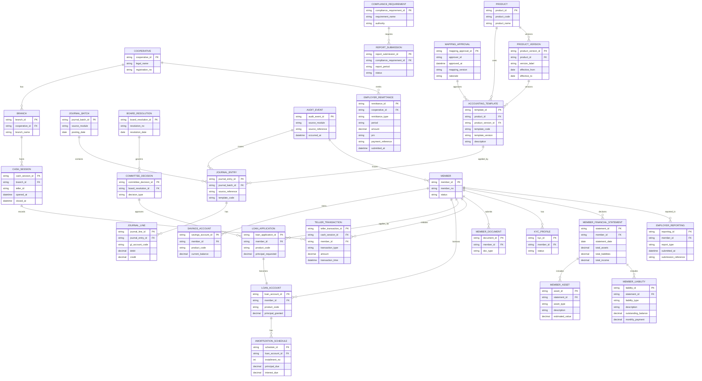

# ERD and Field Dictionary (Draft)

## ERD (Mermaid)

## Field Dictionary (Core Entities)

### Member
| Field | Type | Description | Constraints |
| --- | --- | --- | --- |
| member_id | string | Internal identifier | Required, unique |
| member_no | string | Human-readable member number | Required, unique |
| status | string | Membership status | enum: active, inactive, withdrawn, deceased, delinquent, suspended |
| birth_date | date | Date of birth | Optional |
| tin | string | Tax identification number | Optional, masked in UI |

### Savings Account
| Field | Type | Description | Constraints |
| --- | --- | --- | --- |
| savings_account_id | string | Savings account identifier | Required, unique |
| member_id | string | Member owner | Required, FK |
| product_code | string | Product code | Required |
| current_balance | decimal | Book balance | >= 0 |
| available_balance | decimal | Withdrawable balance | >= 0 |
| status | string | Account status | enum: pending, active, dormant, closed |

### Loan Application
| Field | Type | Description | Constraints |
| --- | --- | --- | --- |
| loan_application_id | string | Application identifier | Required, unique |
| member_id | string | Member applicant | Required, FK |
| product_code | string | Loan product code | Required |
| principal_requested | decimal | Amount requested | >= 0 |
| application_status | string | Workflow status | enum: draft, submitted, for_review, for_ci, for_committee, approved, declined, cancelled |

### Loan Account
| Field | Type | Description | Constraints |
| --- | --- | --- | --- |
| loan_account_id | string | Loan account identifier | Required, unique |
| member_id | string | Member borrower | Required, FK |
| product_code | string | Loan product code | Required |
| principal_granted | decimal | Granted principal | >= 0 |
| interest_method | string | Interest method | enum: diminishing, straight_line, add_on |
| delinquency_bucket | string | Delinquency bucket | enum: current, 1_30, 31_60, 61_90, 91_plus |
| status | string | Loan status | enum: active, paid, restructured, written_off, legal |

### Journal Entry
| Field | Type | Description | Constraints |
| --- | --- | --- | --- |
| journal_entry_id | string | Entry identifier | Required, unique |
| source_module | string | Source module | Required |
| source_reference | string | Source document or transaction | Required |
| posting_date | date | Posting date | Required |
| status | string | Entry status | enum: draft, posted, reversed |
| template_code | string | Accounting template code | Required |

### Compliance Requirement
| Field | Type | Description | Constraints |
| --- | --- | --- | --- |
| compliance_requirement_id | string | Requirement identifier | Required, unique |
| requirement_name | string | Requirement name | Required |
| authority | string | Regulatory authority | enum: CDA, BIR, Other |

### Report Submission
| Field | Type | Description | Constraints |
| --- | --- | --- | --- |
| report_submission_id | string | Submission identifier | Required, unique |
| compliance_requirement_id | string | Requirement reference | Required, FK |
| report_period | string | Reporting period | Required |
| status | string | Submission status | enum: draft, submitted, accepted, rejected, follow_up |

### Board Resolution
| Field | Type | Description | Constraints |
| --- | --- | --- | --- |
| board_resolution_id | string | Resolution identifier | Required, unique |
| resolution_no | string | Resolution number | Required |
| resolution_date | date | Resolution date | Required |
| subject | string | Resolution subject | Required |

### Committee Decision
| Field | Type | Description | Constraints |
| --- | --- | --- | --- |
| committee_decision_id | string | Decision identifier | Required, unique |
| board_resolution_id | string | Parent resolution | Required, FK |
| decision_type | string | Decision category | enum: approve, decline, defer |
| decision_date | date | Decision date | Required |

### Audit Event
| Field | Type | Description | Constraints |
| --- | --- | --- | --- |
| audit_event_id | string | Audit event identifier | Required, unique |
| source_module | string | Source module | Required |
| source_reference | string | Source reference id | Required |
| occurred_at | datetime | Event timestamp | Required |
| actor_id | string | Actor user id | Required |

### Cash Session
| Field | Type | Description | Constraints |
| --- | --- | --- | --- |
| cash_session_id | string | Cash session identifier | Required, unique |
| branch_id | string | Branch reference | Required, FK |
| teller_id | string | Teller user id | Required |
| opened_at | datetime | Session start | Required |
| closed_at | datetime | Session end | Optional |

### Teller Transaction
| Field | Type | Description | Constraints |
| --- | --- | --- | --- |
| teller_transaction_id | string | Teller transaction identifier | Required, unique |
| cash_session_id | string | Cash session reference | Required, FK |
| member_id | string | Member reference | Required, FK |
| transaction_type | string | Transaction type | enum: deposit, withdrawal, collection, disbursement |
| amount | decimal | Transaction amount | >= 0 |
| transaction_time | datetime | Transaction time | Required |

### Mapping Approval
| Field | Type | Description | Constraints |
| --- | --- | --- | --- |
| mapping_approval_id | string | Mapping approval identifier | Required, unique |
| approver_id | string | Approver user id | Required |
| approved_at | datetime | Approval timestamp | Required |
| mapping_version | string | Mapping version identifier | Required |
| rationale | string | Approval rationale | Required |

### Member Financial Statement
| Field | Type | Description | Constraints |
| --- | --- | --- | --- |
| statement_id | string | Statement identifier | Required, unique |
| member_id | string | Member reference | Required, FK |
| statement_date | date | Statement date | Required |
| total_assets | decimal | Total assets | >= 0 |
| total_liabilities | decimal | Total liabilities | >= 0 |
| total_income | decimal | Total monthly income | >= 0 |

### Member Asset
| Field | Type | Description | Constraints |
| --- | --- | --- | --- |
| asset_id | string | Asset identifier | Required, unique |
| statement_id | string | Statement reference | Required, FK |
| asset_type | string | Asset category | Required |
| description | string | Asset description | Required |
| estimated_value | decimal | Estimated value | >= 0 |

### Member Liability
| Field | Type | Description | Constraints |
| --- | --- | --- | --- |
| liability_id | string | Liability identifier | Required, unique |
| statement_id | string | Statement reference | Required, FK |
| liability_type | string | Liability category | Required |
| description | string | Liability description | Required |
| outstanding_balance | decimal | Outstanding balance | >= 0 |
| monthly_payment | decimal | Monthly payment | >= 0 |

### Employer Remittance
| Field | Type | Description | Constraints |
| --- | --- | --- | --- |
| remittance_id | string | Remittance identifier | Required, unique |
| cooperative_id | string | Cooperative reference | Required, FK |
| remittance_type | string | SSS/Pag-IBIG/PhilHealth | Required |
| period | string | Remittance period | Required |
| amount | decimal | Total amount | >= 0 |
| prn | string | PRN reference | Optional |
| payment_reference | string | Payment reference | Required |
| submitted_at | datetime | Submitted timestamp | Required |

### Employer Reporting
| Field | Type | Description | Constraints |
| --- | --- | --- | --- |
| reporting_id | string | Reporting identifier | Required, unique |
| member_id | string | Member reference | Required, FK |
| report_type | string | ER2/RF-1 | Required |
| submitted_at | datetime | Submitted timestamp | Required |
| submission_reference | string | Submission reference | Required |

### Product
| Field | Type | Description | Constraints |
| --- | --- | --- | --- |
| product_id | string | Product identifier | Required, unique |
| product_code | string | Product code | Required, unique |
| product_name | string | Product name | Required |

### Product Version
| Field | Type | Description | Constraints |
| --- | --- | --- | --- |
| product_version_id | string | Version identifier | Required, unique |
| product_id | string | Product reference | Required, FK |
| version_label | string | Version label | Required |
| effective_from | date | Version start | Required |
| effective_to | date | Version end | Optional |

### Accounting Template
| Field | Type | Description | Constraints |
| --- | --- | --- | --- |
| template_id | string | Template identifier | Required, unique |
| product_id | string | Product reference | Required, FK |
| product_version_id | string | Product version reference | Required, FK |
| template_code | string | Template code | Required |
| template_version | string | Template version label | Required |
| description | string | Template description | Optional |
