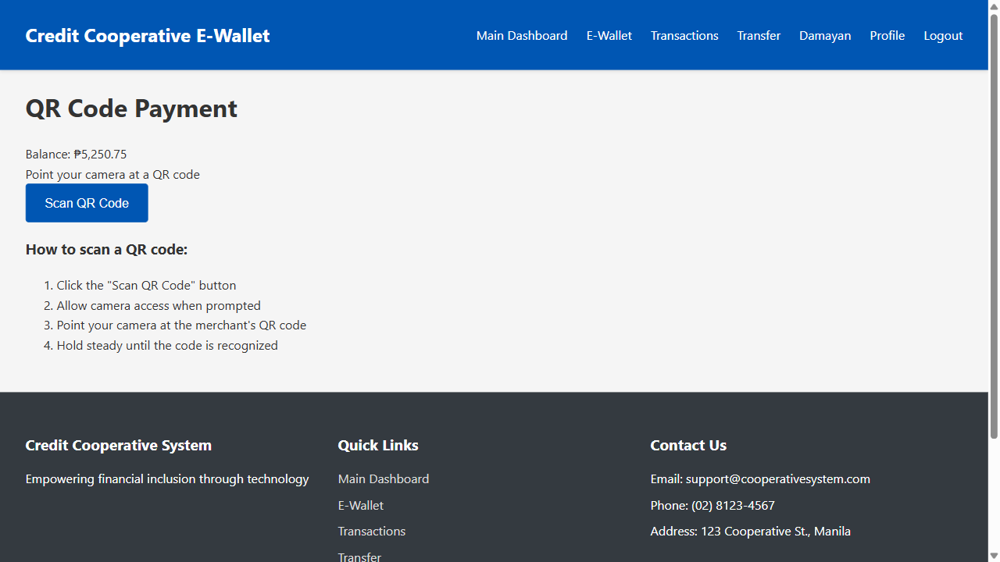
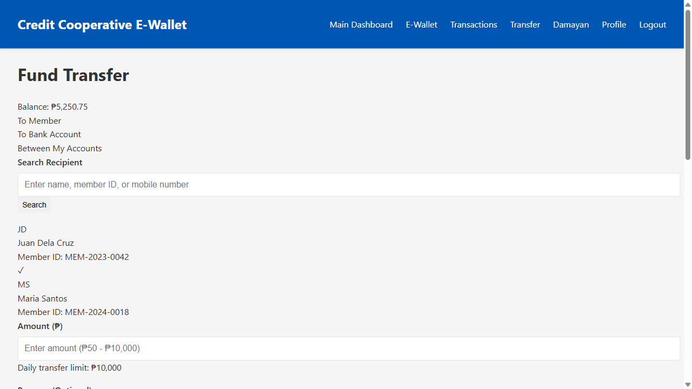
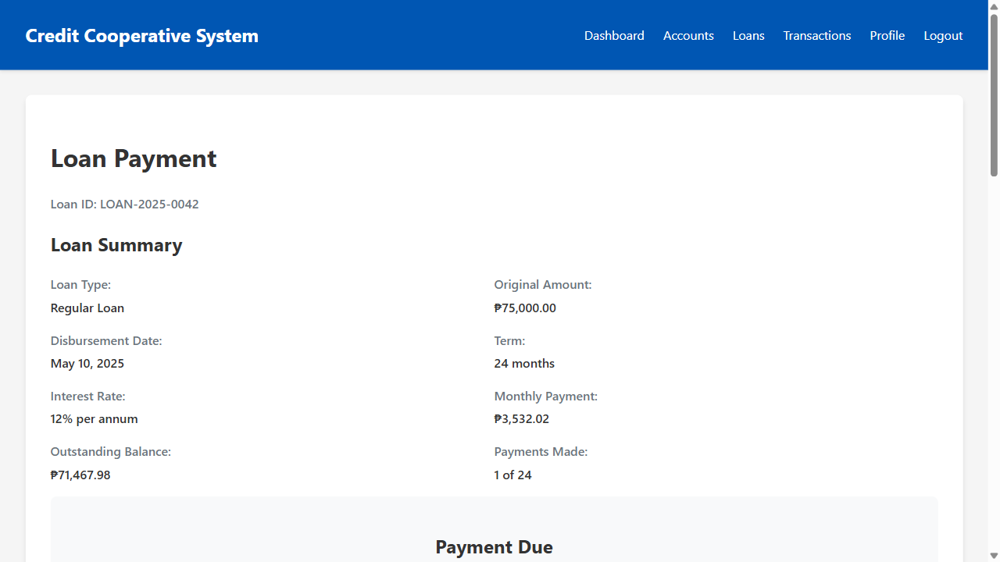
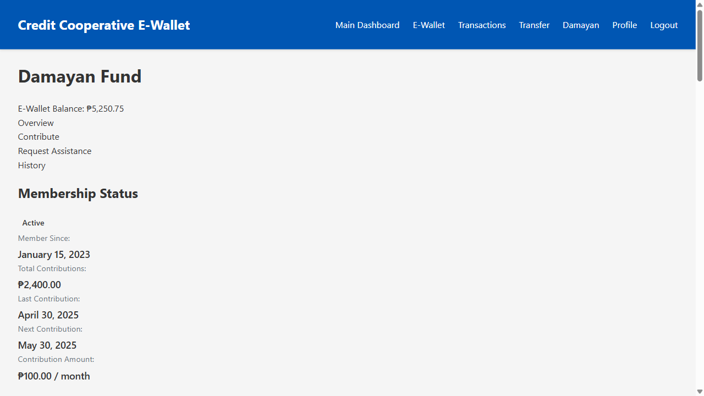
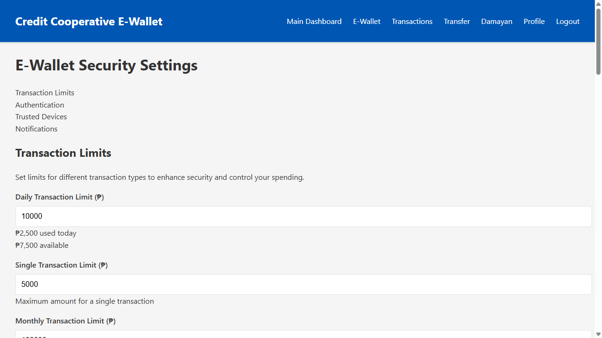

# E-Wallet Key Features Guide

This document provides a detailed overview of the key features in the Credit Cooperative E-Wallet system, focusing on QR code payments, fund transfers, loan payments, Damayan fund integration, and security features.

## 1. QR Code Payments

The QR code payment feature enables members to make quick, secure payments to merchants and other members using their smartphone camera.

### Key Components

- **QR Scanner**: Built-in scanner that uses the device camera to read QR codes
- **Merchant Recognition**: Automatic identification of registered merchants
- **Payment Confirmation**: Clear summary of transaction details before confirmation
- **Receipt Generation**: Digital receipt for all completed transactions
- **Transaction History**: Automatic recording in the member's transaction history

### User Experience

1. Member opens the QR payment screen
2. Points camera at merchant's QR code
3. Reviews payment details (merchant name, amount)
4. Confirms payment with PIN or biometric authentication
5. Receives instant confirmation and digital receipt

### Security Features

- **Transaction Limits**: Configurable maximum amount for QR payments
- **Verification**: PIN or biometric authentication for all transactions
- **Fraud Detection**: Real-time monitoring for suspicious patterns
- **Merchant Verification**: Only registered merchants can receive payments

### Business Benefits

- **Reduced Cash Handling**: Less physical cash in the cooperative branches
- **Transaction Fees**: Potential revenue from merchant transaction fees
- **Member Convenience**: Quick, contactless payment option
- **Merchant Relationships**: Strengthened partnerships with local businesses

## 2. Fund Transfers

The fund transfer feature allows members to send money to other cooperative members quickly and securely.

### Key Components

- **Recipient Search**: Easy lookup of other members by name or ID
- **Amount Configuration**: Flexible transfer amount with clear limits
- **Purpose Specification**: Option to include reason for transfer
- **Transfer Confirmation**: Clear summary before final approval
- **Instant Processing**: Real-time transfer of funds between accounts

### User Experience

1. Member selects the transfer function
2. Searches for and selects recipient
3. Enters amount and optional purpose
4. Reviews transfer details
5. Confirms with PIN or biometric authentication
6. Receives instant confirmation

### Transfer Types

- **Member-to-Member**: Transfers between cooperative members
- **To Bank Accounts**: Transfers to external bank accounts
- **Between Own Accounts**: Transfers between member's different accounts

### Security Features

- **Daily Limits**: Configurable maximum daily transfer amount
- **Recipient Verification**: Confirmation of recipient identity
- **Transaction Authentication**: PIN or biometric verification
- **Fraud Monitoring**: Real-time analysis of transfer patterns

## 3. Loan Payments

The loan payment feature provides a convenient way for members to make payments on their existing loans directly from their E-Wallet.

### Key Components

- **Loan Summary**: Overview of loan details and payment schedule
- **Payment Options**: Multiple payment methods (E-Wallet, bank transfer, etc.)
- **Payment Calculation**: Automatic calculation of principal and interest
- **Payment Confirmation**: Clear summary before final approval
- **Receipt Generation**: Digital receipt for all payments

### User Experience

1. Member views active loans in their account
2. Selects a loan to make a payment
3. Reviews payment details (due amount, breakdown)
4. Selects payment method
5. Confirms payment
6. Receives instant confirmation and updated loan status

### Payment Methods

- **E-Wallet Balance**: Direct payment from available E-Wallet funds
- **Savings Account**: Transfer from member's savings account
- **Bank Transfer**: Payment via external bank account
- **Cash**: Over-the-counter payment at cooperative branches

### Business Benefits

- **Improved Repayment Rates**: Easier payments lead to better loan performance
- **Reduced Administrative Costs**: Less manual processing of payments
- **Better Member Experience**: Convenient, 24/7 payment options
- **Real-time Loan Updates**: Instant updating of loan balances

## 4. Damayan Fund Integration

The Damayan fund integration connects the traditional mutual aid program with the E-Wallet system, making it easier for members to contribute and request assistance.

### Key Components

- **Fund Dashboard**: Real-time view of the Damayan fund status
- **Contribution Management**: Easy processing of regular and additional contributions
- **Assistance Requests**: Digital application for Damayan benefits
- **Benefit Tracking**: Clear overview of available benefits
- **Contribution History**: Complete record of all member contributions

### User Experience

1. Member accesses the Damayan section in the E-Wallet
2. Views their contribution status and available benefits
3. Makes regular or additional contributions with a few taps
4. Submits assistance requests when needed
5. Tracks the status of contributions and requests

### Damayan Benefits

- **Health Emergency**: Financial assistance for hospitalization
- **Bereavement**: Support for funeral expenses
- **Calamity Assistance**: Aid for natural disaster recovery
- **Additional Benefits**: Based on cooperative policies

### Business Impact

- **Increased Participation**: Digital access increases member engagement
- **Streamlined Administration**: Reduced paperwork and manual processing
- **Enhanced Transparency**: Clear tracking of fund status and usage
- **Stronger Community Bond**: Reinforced cooperative principles

## 5. Security Features and Transaction Limits

The security features and transaction limits provide robust protection for member accounts and transactions while allowing flexibility for different needs.

### Key Components

- **Transaction Limits**: Configurable limits for different transaction types
- **Multi-Factor Authentication**: Multiple layers of security verification
- **Device Management**: Control over which devices can access the account
- **Security Notifications**: Alerts for important account activities

### Transaction Limits

| Transaction Type | Default Limit | Configurable Range |
|------------------|---------------|-------------------|
| Daily Total      | ₱10,000       | ₱1,000 - ₱50,000  |
| Single Transaction| ₱5,000        | ₱500 - ₱25,000    |
| QR Payments      | ₱5,000        | ₱500 - ₱25,000    |
| Fund Transfers   | ₱10,000       | ₱1,000 - ₱50,000  |
| Monthly Total    | ₱100,000      | ₱10,000 - ₱500,000|

### Authentication Methods

- **Two-Factor Authentication (2FA)**: Verification codes via SMS or authenticator app
- **Biometric Authentication**: Fingerprint or face recognition on supported devices
- **Transaction PIN**: 6-digit PIN required for all financial transactions
- **High-Value Verification**: Additional verification for transactions above certain thresholds

### Security Notifications

- **Login Alerts**: Notifications when account is accessed from new devices
- **Transaction Alerts**: Real-time alerts for all financial transactions
- **Security Updates**: Notifications about security setting changes
- **Suspicious Activity**: Alerts about potentially unauthorized activities

### User Control

- **Limit Adjustment**: Members can adjust their limits based on needs
- **Authentication Preferences**: Flexibility in choosing security methods
- **Notification Preferences**: Control over which alerts to receive and how
- **Device Management**: Ability to view and remove trusted devices

## Implementation Considerations

### Technical Requirements

- **Mobile Device Compatibility**: Support for both Android and iOS
- **Camera Access**: Permission for QR code scanning
- **Push Notifications**: For real-time alerts and confirmations
- **Biometric API Integration**: For fingerprint and face recognition
- **Secure Storage**: For sensitive authentication data

### Regulatory Compliance

- **Data Privacy Act**: Compliance with personal information protection
- **Anti-Money Laundering**: Transaction monitoring and reporting
- **Know Your Customer (KYC)**: Proper member verification
- **Central Bank Regulations**: Adherence to e-money regulations

### Rollout Strategy

1. **Phase 1**: Basic E-Wallet functionality with QR payments and transfers
2. **Phase 2**: Loan payment integration and Damayan fund features
3. **Phase 3**: Advanced security features and customizable limits

### Success Metrics

- **Adoption Rate**: Percentage of members using E-Wallet features
- **Transaction Volume**: Number and value of digital transactions
- **Error Rate**: Frequency of failed or disputed transactions
- **Support Requests**: Volume of help desk inquiries related to E-Wallet
- **Member Satisfaction**: Feedback scores for E-Wallet features

## Conclusion

The Credit Cooperative E-Wallet's key features—QR code payments, fund transfers, loan payments, Damayan fund integration, and robust security—create a comprehensive digital financial solution that enhances member experience while maintaining the cooperative's core values and security standards.

By implementing these features, the cooperative provides members with modern financial tools that combine convenience, security, and community support, ultimately strengthening member loyalty and operational efficiency.
