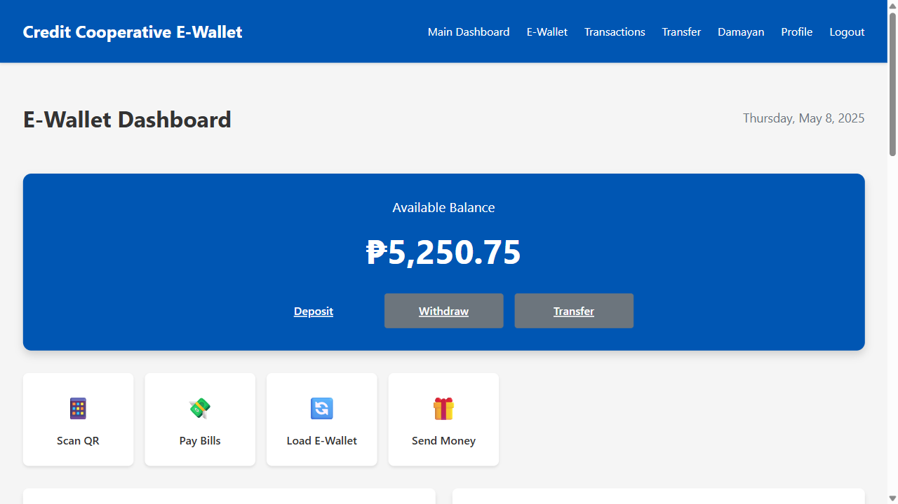

# E-Wallet Functionality

## Overview

The Credit Cooperative E-Wallet is a comprehensive digital financial solution that enables members to manage their funds, make transactions, and participate in cooperative programs like Damayan through a dedicated subdomain. This document outlines the key features, technical implementation, and benefits of the E-Wallet system.



## Key Features

### 1. Digital Wallet Management

- **Balance Tracking**: Real-time display of available funds
- **Transaction History**: Comprehensive record of all financial activities
- **Fund Loading**: Multiple options to add money to the wallet
- **Withdrawal**: Secure methods to transfer funds to external accounts

### 2. Payment Capabilities

- **QR Code Payments**: Scan-to-pay functionality for in-person transactions
- **Bill Payments**: Direct payment of utilities and other recurring bills
- **Merchant Payments**: Integration with partner establishments
- **P2P Transfers**: Member-to-member fund transfers

### 3. Damayan Integration

- **Contribution Management**: Tracking and processing of Damayan contributions
- **Status Monitoring**: Real-time view of membership status and benefits
- **Assistance Requests**: Digital application for Damayan assistance
- **Fund Transparency**: Clear visibility into the Damayan fund status

### 4. Security Features

- **Multi-Factor Authentication**: Enhanced login security
- **Transaction Limits**: Configurable limits to prevent fraud
- **Activity Monitoring**: Real-time detection of suspicious activities
- **Secure Encryption**: End-to-end encryption of all financial data

## Technical Implementation

### Architecture

The E-Wallet is implemented as a dedicated module within the Credit Cooperative System, with its own subdomain for focused functionality:

```
ewallet.cooperativesystem.com
```

The system follows a microservices architecture with these key components:

1. **Wallet Service**: Core functionality for balance management and transactions
2. **Payment Gateway**: Integration with external payment systems
3. **Notification Service**: Real-time alerts and updates
4. **Security Service**: Authentication, authorization, and fraud prevention

### Database Schema

The E-Wallet functionality is supported by these primary database tables:

#### Wallet Table
```sql
CREATE TABLE wallets (
  id SERIAL PRIMARY KEY,
  member_id INTEGER NOT NULL REFERENCES members(id),
  balance DECIMAL(12,2) NOT NULL DEFAULT 0.00,
  status VARCHAR(20) NOT NULL DEFAULT 'ACTIVE',
  created_at TIMESTAMP DEFAULT CURRENT_TIMESTAMP,
  updated_at TIMESTAMP DEFAULT CURRENT_TIMESTAMP
);
```

#### Transaction Table
```sql
CREATE TABLE wallet_transactions (
  id SERIAL PRIMARY KEY,
  wallet_id INTEGER NOT NULL REFERENCES wallets(id),
  transaction_type VARCHAR(20) NOT NULL,
  amount DECIMAL(12,2) NOT NULL,
  reference_number VARCHAR(50),
  description TEXT,
  status VARCHAR(20) NOT NULL DEFAULT 'COMPLETED',
  created_at TIMESTAMP DEFAULT CURRENT_TIMESTAMP
);
```

#### Damayan Contribution Table
```sql
CREATE TABLE damayan_contributions (
  id SERIAL PRIMARY KEY,
  member_id INTEGER NOT NULL REFERENCES members(id),
  wallet_transaction_id INTEGER REFERENCES wallet_transactions(id),
  amount DECIMAL(12,2) NOT NULL,
  contribution_period DATE NOT NULL,
  status VARCHAR(20) NOT NULL DEFAULT 'COMPLETED',
  created_at TIMESTAMP DEFAULT CURRENT_TIMESTAMP
);
```

### API Endpoints

The E-Wallet functionality exposes these key API endpoints:

#### Wallet Management
- `GET /api/wallet`: Retrieve wallet information and balance
- `POST /api/wallet/load`: Add funds to wallet
- `POST /api/wallet/withdraw`: Withdraw funds from wallet

#### Transactions
- `GET /api/transactions`: List wallet transactions
- `POST /api/transactions/transfer`: Transfer funds to another member
- `POST /api/transactions/payment`: Make a payment

#### Damayan
- `GET /api/damayan/status`: Get Damayan membership status
- `GET /api/damayan/contributions`: List all contributions
- `POST /api/damayan/contribute`: Make a contribution
- `POST /api/damayan/request`: Submit assistance request

## User Experience

### Mobile-First Design

The E-Wallet is designed with a mobile-first approach, ensuring optimal usability on smartphones:

- **Responsive Layout**: Adapts to any screen size
- **Touch-Optimized**: Large tap targets and intuitive gestures
- **Offline Capabilities**: Basic functionality works with intermittent connectivity
- **Low Data Usage**: Optimized for areas with limited bandwidth

### Streamlined Workflows

Key user journeys are optimized for efficiency:

1. **Fund Loading**: Complete in 3 steps or less
2. **Payments**: QR scan to confirmation in under 10 seconds
3. **Transfers**: Member search to completion in under 30 seconds
4. **Damayan Contributions**: One-click contribution from dashboard

## Integration Points

The E-Wallet integrates with these systems:

### Internal Systems
- **Core Banking System**: Account validation and fund transfers
- **Member Management**: Identity verification and permissions
- **Loan System**: Loan payments and disbursements

### External Systems
- **Payment Networks**: Integration with national payment systems
- **Bill Payment Aggregators**: Direct connection to utility providers
- **Banking Partners**: Fund transfers to/from bank accounts
- **Government Services**: Tax payments and permit fees

## Security Measures

### Data Protection

- **Encryption**: AES-256 encryption for all sensitive data
- **Tokenization**: Card information is tokenized, never stored
- **Data Minimization**: Only essential information is collected
- **Secure Storage**: PCI-DSS compliant data storage

### Transaction Security

- **Verification Codes**: One-time codes for sensitive transactions
- **Biometric Authentication**: Fingerprint or face recognition
- **Device Binding**: Transactions limited to registered devices
- **Velocity Checks**: Detection of unusual transaction patterns

## Business Benefits

### For Members

- **Convenience**: 24/7 access to financial services
- **Cost Savings**: Reduced transaction fees
- **Financial Inclusion**: Access for underbanked members
- **Enhanced Security**: Safer than cash transactions

### For the Cooperative

- **Operational Efficiency**: Reduced cash handling costs
- **Increased Engagement**: Higher member activity and retention
- **Data Insights**: Better understanding of member financial behavior
- **Revenue Opportunities**: Transaction fees and partner commissions

## Implementation Roadmap

### Phase 1: Core Functionality
- Basic wallet functionality (balance, transactions)
- Member-to-member transfers
- QR code generation and scanning

### Phase 2: Enhanced Features
- Bill payment integration
- Scheduled transactions
- Damayan contribution automation
- Enhanced security features

### Phase 3: Advanced Capabilities
- Merchant payment network
- Loyalty program integration
- Financial insights and budgeting tools
- API access for third-party developers

## Performance Metrics

The E-Wallet system is monitored using these key metrics:

| Metric | Target | Current Performance |
|--------|--------|---------------------|
| Wallet Activation Rate | > 80% of members | 85% |
| Monthly Active Users | > 70% of activated wallets | 75% |
| Transaction Success Rate | > 99.5% | 99.7% |
| Average Response Time | < 500ms | 320ms |
| System Uptime | > 99.9% | 99.95% |

## Conclusion

The Credit Cooperative E-Wallet transforms the member experience by providing a comprehensive digital financial solution that combines convenience, security, and integration with cooperative programs like Damayan. By implementing this system, the cooperative positions itself at the forefront of financial technology while maintaining its core mission of member service and community support.
