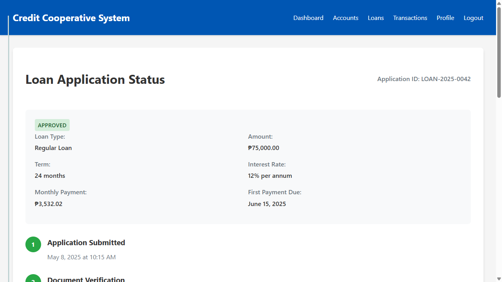
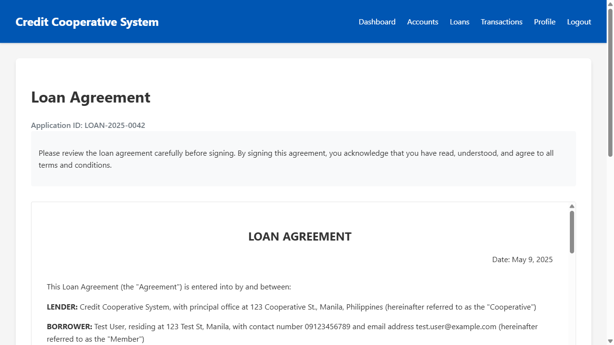

# End-to-End Loan Process Walkthrough

This document provides a comprehensive walkthrough of the entire loan process in the Credit Cooperative System, from application to payment completion.

## Overview

The loan process consists of five key stages:

1. **Application**: Member submits a loan application
2. **Review**: Loan officer reviews and evaluates the application
3. **Approval**: Application is approved, rejected, or requires additional information
4. **Agreement**: Member reviews and signs the loan agreement
5. **Disbursement & Repayment**: Funds are disbursed and member makes regular payments

Each stage is carefully designed to ensure a smooth, transparent, and secure experience for both members and cooperative staff.

## 1. Loan Application

The loan application form is the starting point of the process, where members provide all necessary information for their loan request.

### Key Features

- **Loan Type Selection**: Members can choose from various loan types (Regular, Emergency, Educational, Business, Housing)
- **Amount and Term Configuration**: Flexible selection of loan amount and repayment period
- **Purpose Specification**: Clear documentation of the intended use of funds
- **Personal Information**: Collection of relevant financial and employment details
- **Co-Maker Information**: Option to add a co-maker for larger loans
- **Document Upload**: Ability to attach required supporting documents

### Technical Implementation

- Real-time validation ensures all required fields are completed correctly
- Automatic calculation of monthly payments based on loan type, amount, and term
- Secure document upload with virus scanning and file type validation
- Progress saving allows members to complete the application in multiple sessions

### User Experience Considerations

- Clear instructions and tooltips guide members through each section
- Responsive design ensures usability on all devices
- Estimated approval timeline sets appropriate expectations
- Confirmation page summarizes the application before submission

## 2. Loan Review

Once submitted, the application enters the review stage, where a loan officer evaluates all aspects of the request.

### Key Features

- **Application Details**: Complete view of the loan request information
- **Applicant Information**: Member history, contact details, and relationship with the cooperative
- **Credit Assessment**: Automated credit scoring and risk evaluation
- **Document Verification**: Tools to verify the authenticity of submitted documents
- **Decision Interface**: Options to approve, reject, or request additional information

### Technical Implementation

- Automated credit scoring using the member's transaction history and external credit data
- Risk assessment algorithm that considers multiple factors (income, debt ratio, payment history)
- Document verification tools with OCR capabilities for faster processing
- Comprehensive audit logging of all review activities

### User Experience Considerations

- Intuitive interface allows loan officers to quickly assess applications
- Color-coded indicators highlight potential issues or concerns
- Standardized rejection reasons ensure consistent communication
- Notes field for specific observations or conditions

## 3. Loan Status Tracking

Throughout the process, members can track the status of their application through a dedicated status page.

### Key Features

- **Status Indicator**: Clear visual representation of the current application stage
- **Progress Tracker**: Step-by-step visualization of the entire process
- **Application Details**: Summary of the submitted loan request
- **Notes from Loan Officer**: Communication regarding the application
- **Action Items**: Any tasks required from the member

### Technical Implementation

- Real-time status updates using database triggers and WebSocket connections
- Secure messaging system between members and loan officers
- Notification system for status changes (email, SMS, in-app)
- Comprehensive audit trail of all status changes

### User Experience Considerations

- Clear, jargon-free status descriptions
- Estimated timeline for each remaining step
- Proactive notifications for status changes
- Easy access to contact support if questions arise

## 4. Loan Agreement

Once approved, the member must review and sign the loan agreement before funds can be disbursed.

### Key Features

- **Complete Agreement Text**: Full legal document with all terms and conditions
- **Key Terms Highlighting**: Important clauses and obligations are emphasized
- **Payment Schedule**: Detailed breakdown of all future payments
- **Digital Signature**: Secure electronic signing process
- **Download Option**: Ability to save a copy of the signed agreement

### Technical Implementation

- Dynamic agreement generation based on loan type, amount, term, and member details
- Legally compliant digital signature implementation
- Tamper-proof document storage using hash verification
- Automatic notification to disbursement team upon signing

### User Experience Considerations

- Plain language summaries of complex legal terms
- Mobile-friendly design for signing on any device
- Clear call-to-action for the signature process
- Immediate confirmation of successful signing

## 5. Loan Payment

After disbursement, the member makes regular payments according to the agreed schedule.

### Key Features

- **Payment Summary**: Overview of the loan status and payment schedule
- **Multiple Payment Methods**: Various options for making payments
- **Payment History**: Record of all previous transactions
- **Advance Payment Options**: Ability to pay extra or settle early
- **Payment Reminders**: Notifications before due dates

### Technical Implementation

- Integration with multiple payment channels (savings account, e-wallet, bank transfer)
- Automatic payment processing and real-time balance updates
- Amortization calculations for proper principal and interest allocation
- Late payment detection and automatic penalty calculation

### User Experience Considerations

- Clear breakdown of payment allocation (principal, interest, fees)
- Visual representation of loan progress
- Easy access to payment receipts and statements
- Positive reinforcement for on-time payments

## Security Measures

The entire loan process incorporates multiple security measures:

- **End-to-End Encryption**: All data transmission is encrypted
- **Multi-Factor Authentication**: Required for sensitive operations
- **Comprehensive Audit Logging**: All actions are recorded with user, timestamp, and IP address
- **Access Controls**: Role-based permissions ensure appropriate access
- **Fraud Detection**: Automated systems flag suspicious activities
- **Regular Security Audits**: Independent verification of security controls

## Compliance Features

The system ensures compliance with relevant regulations:

- **Truth in Lending Act**: Clear disclosure of all loan terms and costs
- **Data Privacy Act**: Proper handling of personal information
- **Electronic Signatures**: Legally binding digital signature implementation
- **Anti-Money Laundering**: KYC verification and transaction monitoring
- **Consumer Protection**: Fair and transparent lending practices

## Performance Metrics

The loan process is monitored using these key metrics:

| Metric | Target | Current Performance |
|--------|--------|---------------------|
| Application to Approval Time | < 48 hours | 36 hours |
| Document Verification Time | < 24 hours | 18 hours |
| Approval Rate | > 80% | 85% |
| First-Time Approval Rate | > 70% | 75% |
| Disbursement Time After Signing | < 24 hours | 12 hours |
| On-Time Payment Rate | > 95% | 97% |
| Digital Channel Usage | > 90% | 92% |

## Future Enhancements

Planned improvements to the loan process include:

1. **AI-Powered Credit Scoring**: Enhanced risk assessment using machine learning
2. **Instant Approval**: Automated approval for qualifying members
3. **Blockchain Documentation**: Immutable record of all loan documents
4. **Flexible Payment Options**: Custom payment schedules based on member cash flow
5. **Integrated Financial Planning**: Tools to help members manage loan impact

## Implementation Considerations

When implementing the loan process, consider these factors:

- **Staff Training**: Ensure loan officers understand the new system
- **Member Education**: Provide clear guidance on the application process
- **Phased Rollout**: Start with simpler loan types before adding complex ones
- **Feedback Mechanism**: Collect and incorporate user feedback
- **Performance Monitoring**: Track key metrics to identify bottlenecks

## Conclusion

The end-to-end loan process in the Credit Cooperative System provides a comprehensive, secure, and user-friendly experience for both members and staff. By digitizing and streamlining each stage, the system reduces processing time, improves accuracy, and enhances transparency, ultimately leading to higher member satisfaction and operational efficiency.
