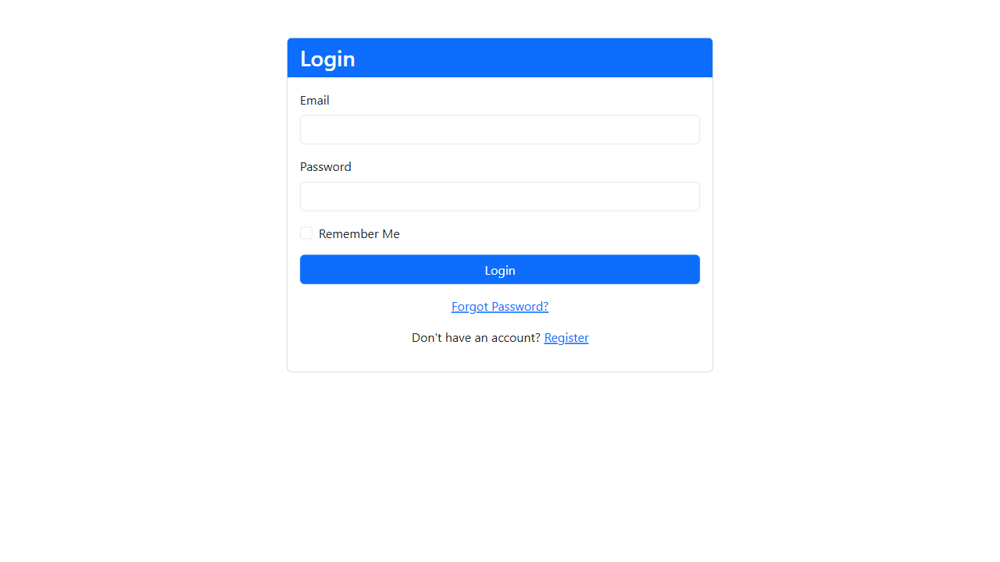
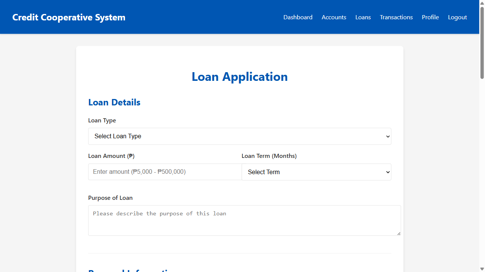
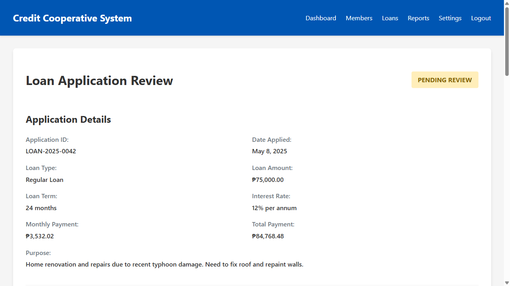

# Credit Cooperative System
## Visual Walkthrough Presentation

---

## Introduction

This presentation provides a visual walkthrough of the Credit Cooperative System, including the main application, E-Wallet subdomain, Damayan feature, and deployment management system. Each slide includes screenshots and explanations of key user journeys and administrative processes.

---

## System Access & Authentication

### Main Login Screen

**Description:** The main login screen provides secure access to the Credit Cooperative System with:
- Username and password fields
- Option for two-factor authentication
- "Forgot Password" recovery option
- System status indicator
- Cooperative branding and logo

### Role Selection

**Description:** After authentication, users with multiple roles can select which role they wish to use for the current session:
- Visual representation of each available role
- Brief description of role permissions
- Last access timestamp for each role
- Option to set default role

---

## Member Management

### Member Dashboard

**Description:** The member dashboard provides a comprehensive overview of a member's status:
- Account balances with ₱ currency symbol
- Recent transactions
- Loan status and payment schedule
- Savings goals progress
- Damayan participation status
- Notifications and alerts

### Member Profile Management

**Description:** The profile management screen allows members to:
- Update personal information
- Manage contact details
- Set communication preferences
- Configure security settings
- View membership history
- Access digital membership card

---

## Account Services

### Account Overview

**Description:** The account overview screen displays:
- All accounts owned by the member
- Current balances with ₱ currency symbol
- Interest rates and terms
- Account activity summary
- Quick action buttons for transfers and payments
- Account statements access

### Transaction History

**Description:** The transaction history screen shows:
- Chronological list of all transactions
- Search and filter options
- Transaction categories with color coding
- Downloadable statements
- Transaction details on demand
- Running balance calculation

---

## Loan Management

### Loan Application Process

**Description:** The loan application screen guides members through:
- Loan type selection
- Amount and term configuration
- Purpose specification
- Required documentation upload
- Co-maker/guarantor information
- Terms and conditions acceptance

### Loan Officer Review Interface

**Description:** The loan officer review interface provides:
- Applicant information and credit history
- Loan details and purpose
- Document verification checklist
- Risk assessment scoring
- Approval/rejection/modification options
- Notes and conditions field

---

## E-Wallet Features

### E-Wallet Dashboard

**Description:** The E-Wallet dashboard on the subdomain shows:
- Current wallet balance with ₱ currency symbol
- Quick action buttons for common transactions
- Recent activity feed
- Saved payment methods
- QR code for receiving payments
- Promotions and special offers

### Fund Transfer Interface

**Description:** The fund transfer screen enables:
- Transfers between own accounts
- Transfers to other members
- Bank transfers via PESONet/InstaPay
- Scheduled/recurring transfers
- Transfer history
- Saved beneficiaries management

---

## Damayan Feature

### Damayan Dashboard

**Description:** The Damayan dashboard provides:
- Current fund status and balance
- Contribution history and schedule
- Available assistance programs
- Community announcements
- Recent disbursements summary
- Governance updates

### Assistance Request Process

**Description:** The assistance request interface guides members through:
- Eligibility verification
- Reason selection and description
- Supporting documentation upload
- Requested amount specification
- Terms acknowledgment
- Submission confirmation

---

## Teller Operations

### Teller Dashboard

**Description:** The teller dashboard shows:
- Transaction queue
- Cash drawer balance
- Daily transaction summary
- Quick member lookup
- Common transaction shortcuts
- End-of-day reconciliation status

### Transaction Processing

**Description:** The transaction processing screen enables tellers to:
- Select transaction type
- Enter member information
- Process deposits/withdrawals
- Issue receipts
- Handle loan payments
- Record transaction notes

---

## Administrative Functions

### Admin Dashboard

**Description:** The administrative dashboard provides:
- System health indicators
- User activity metrics
- Pending approvals queue
- System alerts and notifications
- Quick access to administrative functions
- Audit log summary

### User Management

**Description:** The user management interface allows administrators to:
- Create and manage user accounts
- Assign and modify roles
- Set permission levels
- Reset passwords
- View user activity logs
- Disable/enable accounts

---

## Reporting & Analytics

### Executive Dashboard

**Description:** The executive dashboard presents:
- Key performance indicators
- Membership growth trends
- Loan portfolio performance
- Deposit and withdrawal patterns
- Delinquency rates
- Comparative period analysis

### Financial Reports

**Description:** The financial reporting interface provides:
- Balance sheet generation
- Income statement creation
- Cash flow analysis
- Ratio calculations
- Customizable report parameters
- Export and sharing options

---

## Multi-Environment Management

### Environment Selector

**Description:** The environment selector allows authorized users to:
- Switch between Production, Staging, Testing, and Development
- See current environment status
- View last deployment information
- Access environment-specific settings
- See visual indicators of current environment
- Understand feature differences between environments

### Environment Comparison

**Description:** The environment comparison screen shows:
- Side-by-side feature comparison
- Version differences
- Pending changes awaiting deployment
- Test status indicators
- Performance metrics comparison
- Data synchronization status

---

## Deployment Management System

### Deployment Dashboard

**Description:** The deployment management dashboard displays:
- Current status of all environments
- Recent deployment history
- Scheduled deployments
- Deployment success/failure metrics
- Code change summary
- Quick action buttons for common tasks

### Deployment Process

**Description:** The deployment process interface guides through:
- Environment selection
- Change package selection
- Pre-deployment validation results
- Deployment confirmation
- Progress monitoring
- Success/failure notification

---

## Undo/Redo Functionality

### Change History

**Description:** The change history screen shows:
- Chronological list of all deployments
- Deployed changes with descriptions
- Deployment status indicators
- User who performed each deployment
- Timestamp information
- Undo/redo action buttons

### Undo Confirmation

**Description:** The undo confirmation dialog presents:
- Details of changes to be undone
- Potential impact assessment
- Confirmation requirements
- Rollback plan overview
- Notification settings
- Execution timing options

---

## Data Synchronization

### Data Sync Dashboard

**Description:** The data synchronization dashboard shows:
- Available source and target environments
- Recent synchronization history
- Scheduled synchronizations
- Data volume metrics
- Synchronization success/failure rates
- Quick action buttons

### Data Selection & Anonymization

**Description:** The data selection interface allows:
- Table/schema selection for synchronization
- Anonymization rule configuration
- Data volume preview
- Sensitive data identification
- Exclusion pattern definition
- Validation rule setup

---

## Security & Compliance

### Security Dashboard

**Description:** The security dashboard presents:
- Active user sessions
- Failed login attempts
- Permission change log
- Security alert notifications
- Compliance status indicators
- Audit schedule and findings

### Audit Log Viewer

**Description:** The audit log viewer provides:
- Comprehensive activity logging
- Advanced filtering options
- User activity tracking
- System change history
- Export and reporting capabilities
- Compliance report generation

---

## Mobile Experience

### Mobile App Home

**Description:** The mobile app home screen shows:
- Account balances and quick actions
- Recent transaction summary
- Notification center
- Quick access to E-Wallet
- Damayan status
- Personalized offers

### Mobile Transaction Flow

**Description:** The mobile transaction flow demonstrates:
- QR code scanning for payments
- Biometric authentication
- Transaction confirmation
- Receipt generation
- Transaction success notification
- Balance update

---

## System Monitoring

### Monitoring Dashboard

**Description:** The monitoring dashboard displays:
- System health indicators
- Performance metrics
- Error rate tracking
- User activity levels
- Database performance
- API response times

### Alert Configuration

**Description:** The alert configuration interface allows:
- Threshold setting for various metrics
- Notification method selection
- Alert priority configuration
- Escalation path definition
- Alert testing
- Alert history review

---

## Role-Based Dashboards

### Board of Directors View

**Description:** The Board of Directors dashboard presents:
- Strategic KPIs
- Governance metrics
- Risk indicators
- Membership growth trends
- Financial performance summary
- Compliance status overview

### General Manager View

**Description:** The General Manager dashboard shows:
- Operational KPIs
- Staff performance metrics
- Member satisfaction indicators
- Product performance data
- Branch comparison
- Daily operational summary

---

## Implementation Journey

### Implementation Timeline

**Description:** The implementation timeline visualizes:
- Project phases and milestones
- Current progress indicators
- Upcoming activities
- Resource allocation
- Critical path identification
- Dependency mapping

### Training Program

**Description:** The training program interface shows:
- Role-based training modules
- Completion status tracking
- Knowledge assessment results
- Training resources library
- Certification paths
- Refresher course scheduling

---

## Conclusion

### System Benefits Summary

**Description:** The benefits summary screen presents:
- Key efficiency improvements
- Member experience enhancements
- Risk reduction metrics
- Cost savings calculations
- Competitive advantages
- Future opportunity areas

### Next Steps

**Description:** The next steps screen outlines:
- Immediate action items
- Decision points for management
- Resource requirements
- Timeline for next phases
- Success criteria
- Feedback collection process

---

## Thank You

**For more information or to schedule a live demonstration, please contact:**

- Project Manager: [Name]
- Email: [Email]
- Phone: [Phone]

---

**Note:** This presentation contains placeholder images. In the actual presentation, these will be replaced with real screenshots from the Credit Cooperative System.
