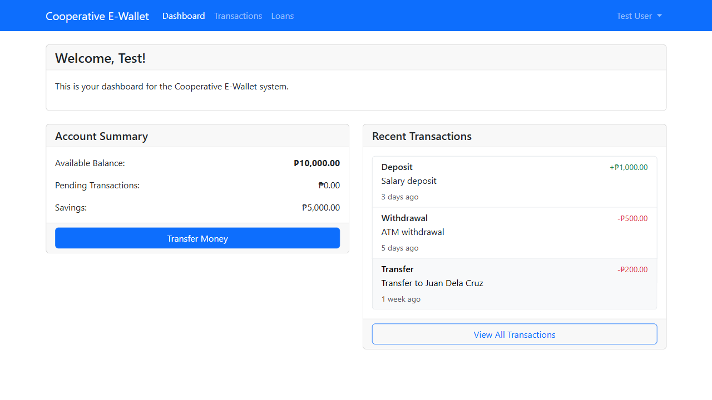

# Credit Cooperative System User Role Screenshots

This document provides screenshots of the different user role dashboards in the Credit Cooperative System, showcasing the unique features and interfaces available to each role.

## 1. Member Dashboard

The Member Dashboard is designed for regular cooperative members, providing access to their personal accounts, loan applications, and cooperative services.

### Key Features

- **Account Summary**: Overview of savings, loans, and shares
- **Recent Transactions**: List of recent account activities
- **Loan Status**: Current status of loans and applications
- **Quick Actions**: Shortcuts to common member tasks
- **Announcements**: Important cooperative news and updates

### User Experience

Members can easily monitor their financial status, apply for loans, make payments, and access cooperative services through a clean, intuitive interface designed for both desktop and mobile use.

## 2. Administrator Dashboard

The Administrator Dashboard provides comprehensive system management tools, user administration features, and technical operation controls.

### Key Features

- **Summary Cards**: Quick overview of key metrics (members, loans, savings, alerts)
- **Recent Member Activities**: Real-time feed of member actions
- **Pending Approvals**: Queue of items requiring administrator review
- **System Health**: Monitoring of technical infrastructure
- **Quick Actions**: Shortcuts to common administrative tasks

### User Experience

Administrators have full visibility into system operations with powerful tools to manage users, configure settings, and ensure the system runs smoothly and securely.

## 3. Board of Directors Dashboard

The Board of Directors Dashboard focuses on governance, policy review, and strategic oversight of the cooperative's operations.

### Key Features

- **Financial Performance**: Key financial metrics and trends
- **Policy Review**: Queue of policies requiring board approval
- **Upcoming Meetings**: Schedule of board and committee meetings
- **Governance Metrics**: Compliance and risk management indicators
- **Financial Charts**: Visual representation of financial performance

### User Experience

Board members can easily monitor the cooperative's financial health, review and approve policies, and track governance metrics through a dashboard designed for strategic decision-making.

## 4. General Manager Dashboard

The General Manager Dashboard provides tools for operational management, staff supervision, and implementation of board-approved policies.

### Key Features

- **Operational KPIs**: Key performance indicators for cooperative operations
- **Staff Performance**: Department and individual performance metrics
- **Strategic Initiatives**: Progress tracking of key projects
- **Tasks & Approvals**: Personal task list and approval queue
- **Quick Actions**: Shortcuts to common management tasks

### User Experience

General Managers have a comprehensive view of operations with tools to monitor performance, manage staff, track strategic initiatives, and handle day-to-day management tasks.

## 5. Credit Officer Dashboard

The Credit Officer Dashboard is specialized for loan application review, portfolio management, and delinquency monitoring.

### Key Features

- **Pending Loan Applications**: Queue of applications requiring review
- **Loan Performance**: Portfolio quality indicators
- **Delinquent Loans**: List of overdue loans requiring attention
- **Credit Scoring**: Distribution of member credit scores
- **Quick Actions**: Shortcuts to common loan management tasks

### User Experience

Credit Officers can efficiently process loan applications, monitor portfolio performance, and manage delinquent loans through a dashboard designed specifically for credit management.

## 6. Teller Dashboard

The Teller Dashboard is optimized for front-line transaction processing, cash management, and member service.

### Key Features

- **Transaction Summary**: Count and value of daily transactions
- **Cash Management**: Cash drawer balance and denomination breakdown
- **Member Queue**: Current queue status and member waiting list
- **Recent Transactions**: List of recently processed transactions
- **Daily Summary**: End-of-day transaction totals and reconciliation

### User Experience

Tellers can quickly process member transactions, manage their cash drawer, and serve members efficiently through a streamlined interface designed for high-volume transaction processing.

## Mobile Responsiveness

All dashboards in the Credit Cooperative System are fully responsive, providing an optimal user experience across desktop, tablet, and mobile devices. The mobile interface maintains all critical functionality while adapting the layout for smaller screens.

## Accessibility Features

The Credit Cooperative System dashboards include the following accessibility features:

- **High Contrast Mode**: Enhanced visibility for users with visual impairments
- **Keyboard Navigation**: Full functionality without requiring mouse input
- **Screen Reader Compatibility**: Proper labeling and ARIA attributes
- **Text Scaling**: Support for browser text size adjustments
- **Focus Indicators**: Clear visual cues for keyboard navigation

## Security Features

Each dashboard implements role-based security controls:

- **Authentication**: Multi-factor authentication options for sensitive roles
- **Authorization**: Granular permission controls based on role definitions
- **Session Management**: Automatic timeout and secure session handling
- **Audit Logging**: Comprehensive logging of all user actions
- **Data Filtering**: Row-level security to restrict data access by role

## Conclusion

The Credit Cooperative System's role-specific dashboards ensure that each user has access to the tools and information they need to perform their specific functions within the cooperative, while maintaining appropriate security controls and separation of duties.
